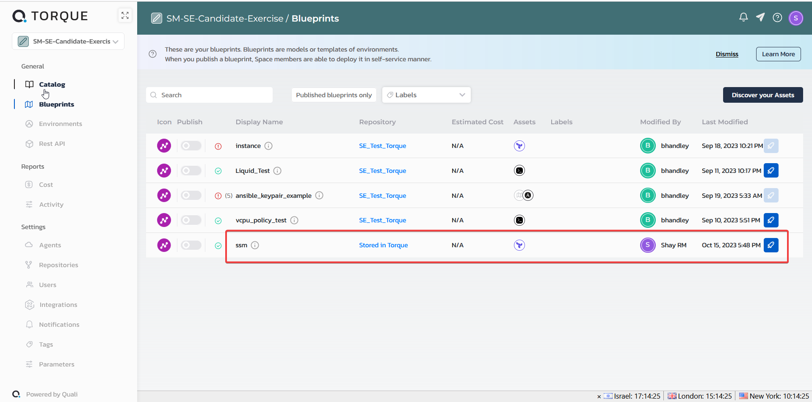
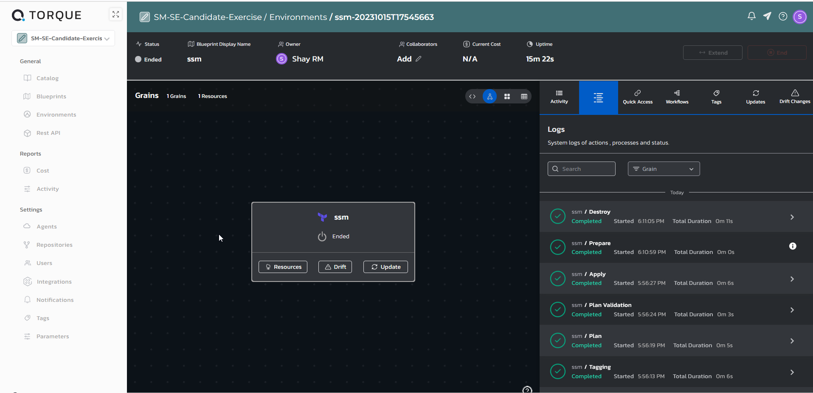
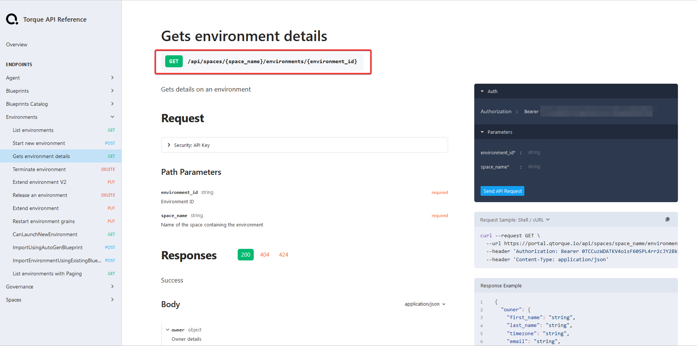
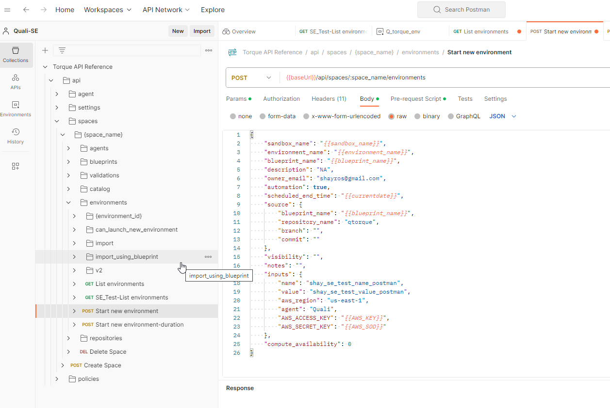
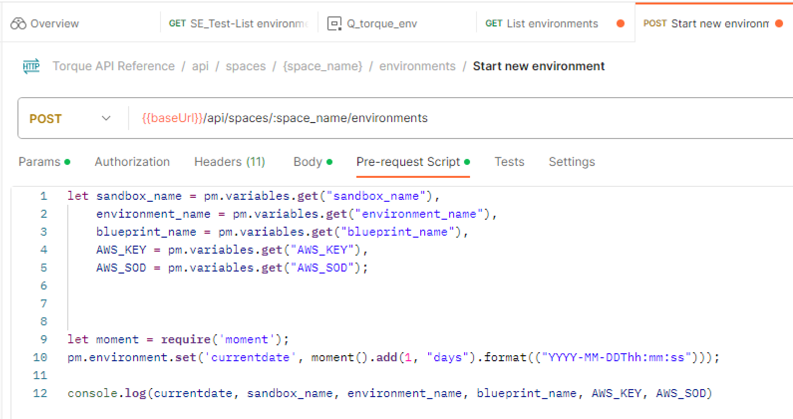
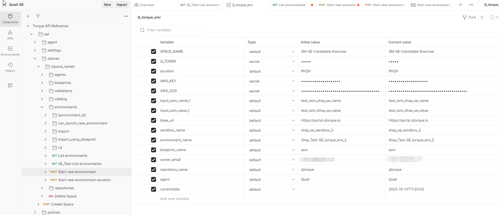
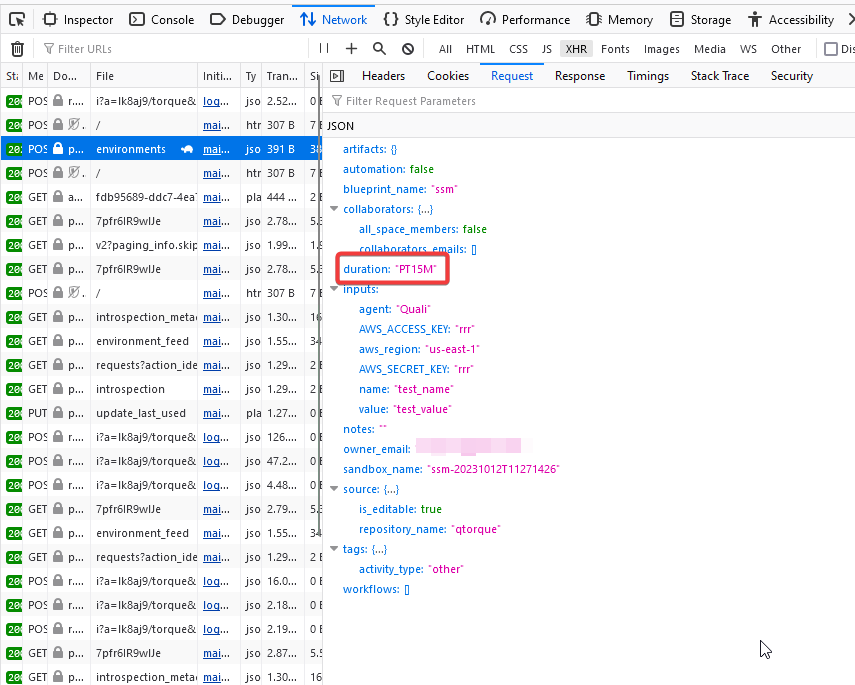
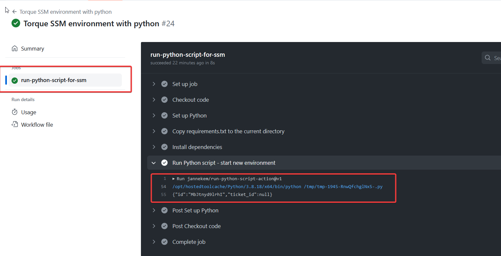
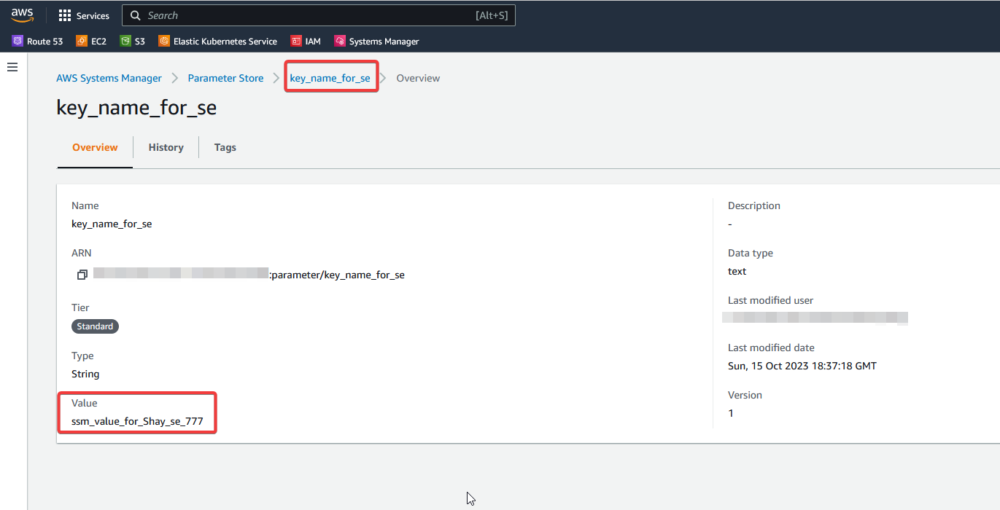

# Technical Evaluation Exercise 

- [Technical Evaluation Exercise](#technical-evaluation-exercise)
  - [Experience Torque Product](#experience-torque-product)
    - [overview](#overview)
  - [Task activities](#task-activities)
    - [Initiation and setup](#initiation-and-setup)
    - [Blueprint modification.](#blueprint-modification)
    - [Launch Environment](#launch-environment)
    - [Automation and REST calls](#automation-and-rest-calls)
    - [Github Action workflow](#github-action-workflow)
  - [Conclusions](#conclusions)


## Experience Torque Product

### overview
This exercise is designed to allows potential SE to gain experience with Quali Torque SaaS product and demonstrate problem solving, integration and technical skills.

The main parts of this exercise include the following tasks:

:white_check_mark: Explore and review Torque SaaS platform.

:white_check_mark: Review and understand Torque Blueprints and Environments.

:white_check_mark: Get familiar with Torque product and API documents.

:white_check_mark: discover an existing Terraform module, create a Blueprint and launch the Blueprint.

:white_check_mark: Automate the launch of the Blueprint by REST call with github actions.

:white_check_mark: Understand Quali Torque SaaS product value proposition.

## Task activities

Below is a list of activities made to complete the exercise and execute the task. Each phase will include reference from the code modified, activities and the documents used to resolve and assist completing the task.

### Initiation and setup
The initiation phase includes discovery and import of the destination repository to Torque for creating the blueprints.
In this phase I used the **Asset Discovery** procedure describes in Torque document:  

:owl: https://docs.qtorque.io/getting-started/Discover%20Your%20Assets 

The following activities were executed:

1) Login to Torque and review the menu options
2) Fork Quali Torque github source from: https://github.com/bhandley/BH_Torque_examples to my repository: https://github.com/shayrm/SE_Test_Torque
3) Review the `ssm.tf` file and understand the used resources and inputs.
4) In Torque SaaS use the **Repositories** option to integrate to my Github repository.
5) Allow discovery of my repository to Torque repository with required permissions.
6)  Review the ssm blueprint which was added to the Blueprint section.

### Blueprint modification.
The imported Terraform stor and create a new key value pair in AWS System Service Management. 
The initiation phase and Blueprint creation basically managed to enrich the original .tf file with additional options such as:
 
 * Duration - environment timer.
 * Blueprint inputs - provided by the user
 * Tags - The user could add default tags for better metadata records.  
 * Use API or cli plugin when creating an environment with REST.
 * Rule base policy - to enforce environment setup.

(below is the ssm blueprint yaml file for reference).

I used Torque document below to modify the Blueprint's inputs and add AWS credentials

:owl: https://docs.qtorque.io/getting-started/Getting%20starting%20with%20terraform

:owl: https://docs.qtorque.io/getting-started/Getting%20starting%20with%20terraform#aws-authentication

At the end of the process the following ssm yaml file was created:

```yaml
spec_version: 2
description: Torque auto generated blueprint
# blueprint inputs can be provided by the user, API or CI plugin when creating an environment from this blueprint.
inputs:
  aws_region:
    type: string
    default: us-east-1
  name:
    type: string
    default: test_name
  value:
    type: string
    default: test_value
  agent:
    type: agent
  AWS_ACCESS_KEY:
    type: string
  AWS_SECRET_KEY:
    type: string
# blueprint outputs define which data that was generated during environment provisioning will be returned to the user, API or CI.
outputs:
  ssm_ssm_parameter_name:
    value: '{{ .grains.ssm.outputs.ssm_parameter_name }}'
    quick: true
  ssm_ssm_parameter_value:
    value: '{{ .grains.ssm.outputs.ssm_parameter_value }}'
    quick: true
grains:
  ssm:
    kind: terraform
    spec:
      source:
        store: SE_Test_Torque
        path: terraform/ssm
      agent:
      # The Torque agent that will be used to provision the environment.
        name: '{{ .inputs.agent }}'
        # A service account annotated with a role ARN with permissions to run the asset
        # service-account: <service-account-name>
        # Will override the default value for Runners isolation
        # isolated: <boolean>
      inputs:
      - aws_region: '{{ .inputs.aws_region }}'
      - name: '{{ .inputs.name }}'
      - value: '{{ .inputs.value }}'
      # The environment variables declared in this section will be available during the grain deployment as well as the grain destroy phase
      # env-vars:
      # - VAR_NAME: var value
      env-vars: 
        - AWS_ACCESS_KEY: '{{ .inputs.AWS_ACCESS_KEY }}'
        - AWS_SECRET_KEY: '{{ .inputs.AWS_SECRET_KEY }}'
      outputs:
      - ssm_parameter_name
      - ssm_parameter_value
    # The terraform version that will be used to deploy the module
    tf-version: 1.5.5

```

> [!WARNING] 
> It would be good if the `AWS_ACCESS_KEY` and `AWS_SECRET_KEY` were masked and not presented as a clear text in the environment logs.
> 

### Launch Environment 
At first I launch the environment from the GUI.
This phase alow me to make sure the Blueprint is correct and environment could be executed to produce the required IaaC.

Below is an example of manual execution:





### Automation and REST calls

Now after confirming manual launch of the environment, I moved on to the remote execution of the environment with REST API call.
For that I use Torque API document and study how the API could be use for executing new environment from blueprint.

:owl: https://portal.qtorque.io/api_reference/#/paths/api-spaces-space_name--environments/post

To generate Authorization token I had to go to the Integrations page and click the Connect button on **GitHub Action** instruction.
In the Configure section, I could click on “Generate New Token” and copy the displayed token value. 


At first, I tried to list the existing environment `Gets environment details`




Confirming the Token validation, I could move on and use the POST `/api/spaces/{space_name}/environments`

Next step was to import the API reference from [Torque API Reference](https://portal.qtorque.io/api_reference/#/) to Postman.
In Postman I could define environment parameters which could help later on with the Github Action yaml file.

Define the relevant Global Environment and Pre-request-script to successfully define the POST schema.








> [!IMPORTANT]  
> During my attempts to generate the correct POST request I had to figure out the syntax of the `duration` field.
> I had to manually lunch again the `ssm` blueprint and use the browser Dev tools to track down the post request and verify the correct syntax of the `duration` field.
>

 
 

Now that I could run the API request from remote I could create the structure of the Github action workflow.

### Github Action workflow

To run the workflow I choose to use manual `workflow_dispatch` following the [Manually running a workflow](https://docs.github.com/en/actions/using-workflows/manually-running-a-workflow) instructions.

I used github **Actions secrets and variables** to create the relevant secrets (AWS keys and Torque token) and variables.

To run the request I chose to use Python script with the `request` command.

The github action could be found file could be found in this repository at [start_ssm_env_py.yml](../.github/workflows/start_ssm_env_py.yml)

```yaml

####################################
# Workflow Metadata
###################################
name: Torque SSM environment with python

###################################
# workflow inputs
###################################
on:
  workflow_dispatch:
    inputs:
      aws_region:
        description: 'AWS default region'
        type: string
        required: true
        default: us-east-1
      ssm_name:
        description: 'Provide ssm key name name'
        type: string
        required: true
        default: key_name_for_se
      ssm_value:
        description: 'Provide ssm value'
        type: string
        required: true
        default: ssm_value_for_Shay_se_100

######################
# Jobs
######################
jobs:
  run-python-script-for-ssm:
    runs-on: ubuntu-latest
    steps:
      - name: Checkout code
        uses: actions/checkout@v2
  
      - name: Set up Python
        uses: actions/setup-python@v4
        with:
          python-version: 3.8
          
      - name: Copy requirements.txt to the current directory
        run: cp .github/requirements.txt .

      - name: Install dependencies
        run: pip install -r requirements.txt

      - name: Run Python script - start new environment 
        id: python-script
        uses: jannekem/run-python-script-action@v1
        with:
          script: |
            import requests
            import json
            import os

            url = "https://portal.qtorque.io/api/spaces/${{ vars.SPACE_NAME }}/environments"

            payload = json.dumps({
              "sandbox_name": "${{ vars.SENDBOX_NAME }}",
              "environment_name": "${{ vars.ENVIRONMENT_NAME}}_${{ github.run_number }}",
              "blueprint_name": "${{ vars.BLUEPRINT_NAME }}",
              "description": "NA",
              "owner_email": "${{ vars.OWNER_EMAIL}}",
              "automation": True,
              "duration": "${{ vars.DURATION }}",
              "source": {
                "blueprint_name": "${{ vars.BLUEPRINT_NAME }}",
                "repository_name": "${{ vars.REPO_NAME }}",
                "branch": "",
                "commit": ""
              },
              "visibility": "",
              "notes": "",
              "inputs": {
                "name": "${{ inputs.ssm_name }}",
                "value": "${{ inputs.ssm_value }}",
                "aws_region": "${{ inputs.aws_region }}",
                "agent": "${{ vars.AGENT }}",
                "AWS_ACCESS_KEY": "${{ secrets.AWS_ACCESS_KEY }}",
                "AWS_SECRET_KEY": "${{ secrets.AWS_SECRET_KEY }}"
              },
              "compute_availability": 0
            })
            headers = {
              'Content-Type': 'application/json',
              'Accept': 'application/json',
              'Authorization': 'Bearer ${{ secrets.TORQUE_TOKEN }}'
            }

            response = requests.request("POST", url, headers=headers, data=payload)
            
            print(response.text)

```

Below, example of successful Github action workflow and the **event id** created following the POST request.



On the target AWS account we got the following results:




## Conclusions

In conclusion, this technical evaluation exercise provided a comprehensive opportunity to gain hands-on experience with Quali Torque's SaaS product and demonstrate various technical skills, including problem-solving, integration, and automation.

The exercise resulted in the successful remote launch of the environment, as demonstrated by a GitHub Action workflow. This event ID confirmed the execution of the POST request, and corresponding results were observed in Torque environment page in the target AWS account. The environment was terminated at the duration timer expiration.

The Quali Torque SaaS solution offers a range of business benefits that can significantly impact an organization's operations and outcomes. These benefits extend beyond technical capabilities and are instrumental in achieving business goals and objectives. Here are some key aspects of the business value that Torque brings to the table:

1. Improved Efficiency and Productivity
2. Cost Reduction
3. Enhanced Collaboration
4. Scalability and Flexibility
5. Risk Mitigation (manual processes and human error)
7. Compliance and Reporting

And probably there are many more...


